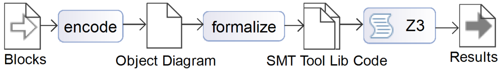

# ContractCheck
## Tool Description ([Spin 2022 Presentation](2022Spin.pdf))
In a legal contract, the contracting parties sign agreements. From an aggreement a claim of a contract party arises if certain conditions are met. A lawyer will interpret after the signing of a contract whether the conditions are met (subsumption) and a claim arises. A contract party can either fulfill a claim or has to deal with consequences that arise in form of other claims. A legal contracts can describe hundreds of claims such that contradictions between claims are hard to find and compensation costs are complicated to estimate.

The tool ContractCheck can analyze before the contract signing if a contract is consistent and behaves as the contract parties expect. After contract signing, the tool can support a contract party to select the claims to assert and to fulfill and the dates to take actions.

## Legal Analysis Workflow

The workflow of the tool ContractCheck is depicted in the diagram.
The user selects and parameterizes text blocks, then ContractCheck compiles a UML object diagram from the text blocks and the
information regarding the class structure encoded in the SPA class diagram. The object diagram serves as an internal
representation and does not need to be edited by the user. ContractCheck extracts the formal representation of the SPA to
be analyzed from the object diagram and synthesizes logical encodings.



### Contract Formalization
A contract is formalized into blocks. A block contains the legal text and a formalization of the contained claims: 
- the debtor and creditor,
- the claim conditions, and
- relations to other claims. 

Simple Contract Example:

Eva sells a bakery to Chris for 40.000 Euros. She signs that the bakery can bake 10.000 pretzels a day, otherwise the purchase price is reduced by 1000€ for every 100 pretzels that are less baked. Chris has to assert less pretzels within 14 days, the compensation is limited by a year.

Claims in the Example:
- Eva debts Chris to transfer the bakery on the closing date `C` (TransferClaim)
- Chris debts Eva to transfer 40.000 Euros on date `C` (PayClaim).
- Eva depts Chris that the number `P` of pretzels is greater as 10.000 (PretzelWarranty).
- If the PretzelWarranty is unfulfilled and Chris asserts it within `C+14` days, Eva debts `(P-10.0000)*100€/1000` for `C+365` days (CompensationClaim)

### Contract Executions
On an abstract level, every claim 
- arises or not, and
- is fulfilled or not of the debting contract party.

A contract execution is a value assignment of these two dimensions for every claim. In case a debting contract party does not fulfill a claim, other claims should arise that places the debting contract party in a worse position. Only certain combinations of claims are possible.
- If the PretzelWarranty arises and is not fulfilled, the CompensationClaim arises.
- If the PretzelWarranty arises and is fulfilled, the CompensationClaim cannot arise.

This abstraction gives the idea of a contract execution. The tool can deal with more fine grained execution details, dates, deadlines and ownership structures. 

### Contract Verification
The tool computes the possible executions of a contract and check for errors: 
- Can every claim arise and can it be fulfilled?
- Does a consequence claim exist for every not fulfilled claim?
- Does a contract execution exist?
- Can compensations result in a negative purchase price?

Example:
- Eva transfers the claim (arise+fulfilled).
- Chris transfers the 40.000€ (arise+fulfilled).
- Chris asserts after 7 days that the bakery just bake 5.000€ (arise+unfulfilled).
- Eva pays a compensation of 50.000€ (arise+fulfilled).
- The result is a negative purchase price of -10.000€.

## Tool Prerequisites

For the installation make sure that JDK newer than version 11 and Maven are installed on your system. This guide shows the process in Eclipse thus it is recommended to use a new version of Eclipse as your IDE.
You also need to install the <a href="https://github.com/z3prover/z3/pkgs/container/z3">Z3Prover</a> for the analysis.

## Examples in the Tool

Two contract encodings and can be analyzed `pretzelSPA_bad.json` and `contract_long.json`.
The contracts are in the folder `src_LegalCheck/legaltech.job_legalcheck/src/test/resources`.

## Installation

### Download Jobscheduler

```
git clone https://github.com/sen-uni-kn/JobScheduler JobScheduler-main
```

### Download ContractCheck

```
git clone https://github.com/sen-uni-kn/ContractCheck ContractCheck-main
```

### Import JobScheduler

- Open Eclipse

- Go to File/Import...

- Go to Maven and select Existing Maven Projects

- Select the `JobScheduler-main` folder

- Deselect the root `.pom` (the tick at the very top) and leave every other box ticked. 

- Press Finish

Maven should now build the project. Wait until it's finished and proceed to the next step.

### Import ContractCheck

- Open Eclipse

- Go to File/Import...

- Go to Maven and select Existing Maven Projects

- Select the `ContractCheck-main` folder

- Press Finish

Maven should again build the project. After it's finished you may run the program.

### Add a private key

- Navigate to `legaltech.webeditor` in subfolder `legaltech.webeditor/src/main/resources` and open `application.properties`.

- Generate a new keystore.p12 private key:

```
keytool -genkeypair -alias tomcat -keyalg RSA -keysize 2048 -storetype PKCS12 -keystore keystore.p12 -validity 3650
```
- Enter the password found in `application.properties` at `server.ssl.key-store-password`.

- You may skip the rest of the questions and confirm with `y` to finish.

- Move the keystore.p12 into the `legaltech.webeditor` folder.


### Run ContractCheck

- Navigate to `legaltech.webeditor` -> `src/main/java` -> `kn.uni.sen.joblibrary.legaltech.web` -> `LegalTechWebEditor.java`

- Run it with rightclick on `LegalTechWebEditor.java` as Java Application. You may need to authorize the connection by your Firewall.

- Open a browser of your choice (e.g. Firefox) and type https://localhost:8443/ into your main bar.

- Your Browser may warn you about a potential Security Risk. Press Advanced -> Accept and Continue.

- Type in the username and password found in `application.properties` at `spring.security.user.name` and `spring.security.user.password`

- You can now load a contract (e.g. `pretzelSPA_bad.json` in `src_LegalCheck/legaltech.job_legalcheck/src/test/resources`) via New Contract

### Z3 Installation Tips

If you experience trouble installing Z3 on your machine, you might want to try to install it via Python's `pip installer` which may take care of the Java bindings.
Alternatively you could also copy the necessary libraries of the pre-built releases into your `Java PATH` : 

`com.microsoft.z3.jar`
`libz3java.dll`
`libz3java.lib`
`libz3.lib`
`libz3.dll`
